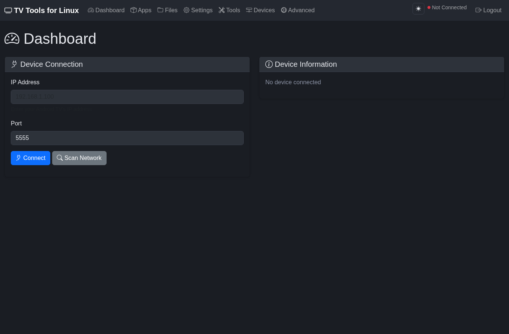
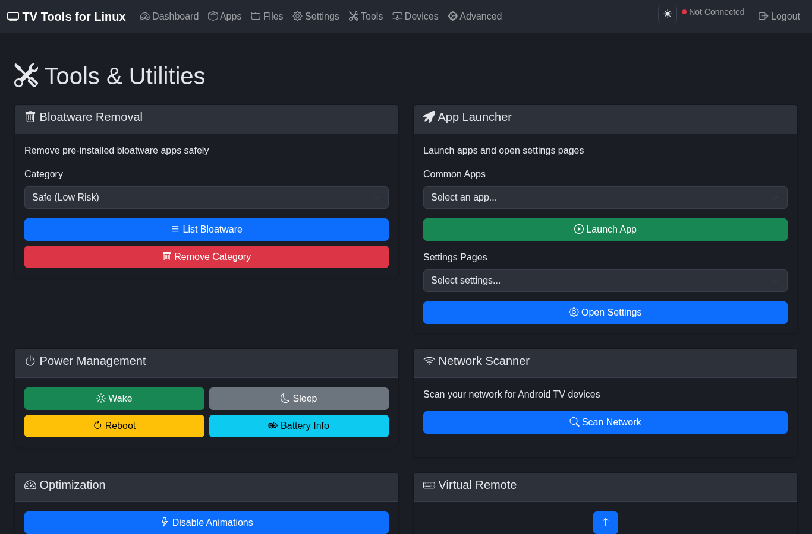
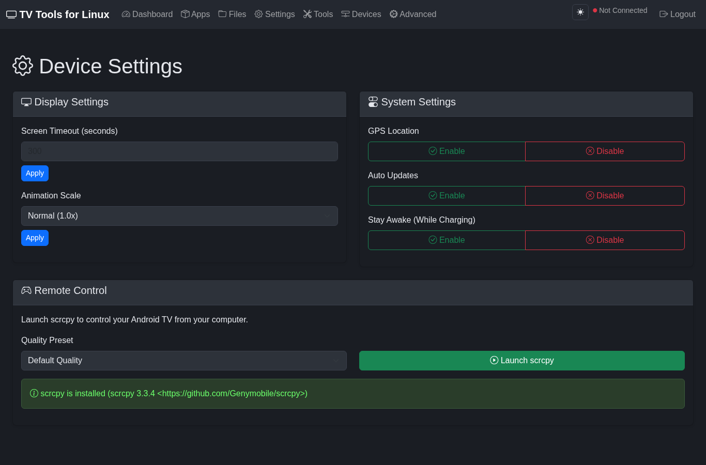
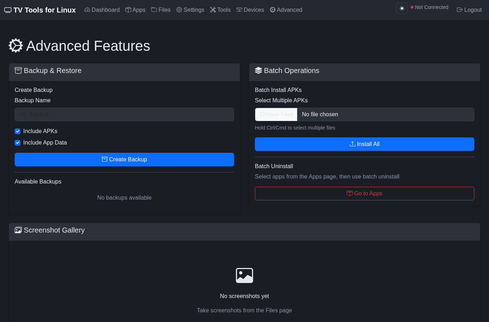
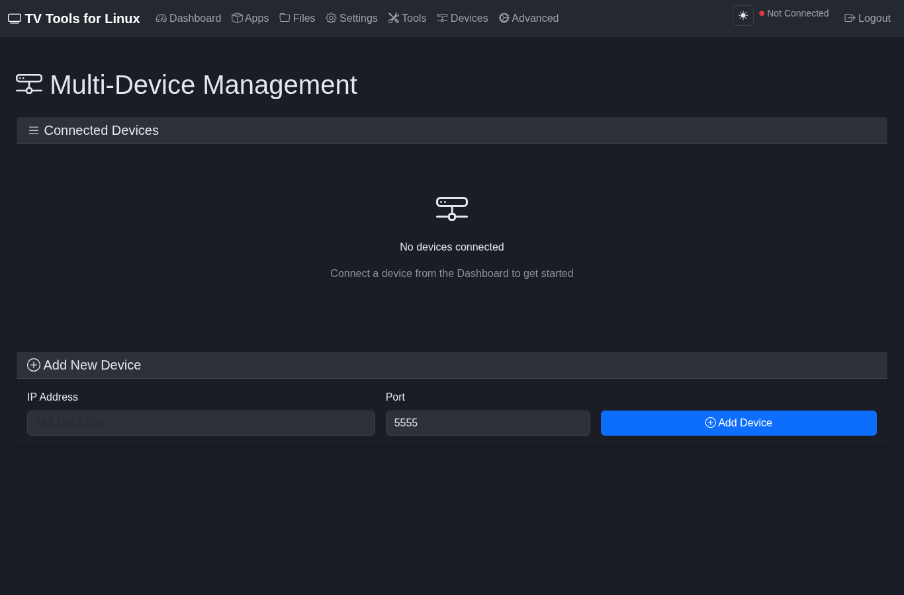
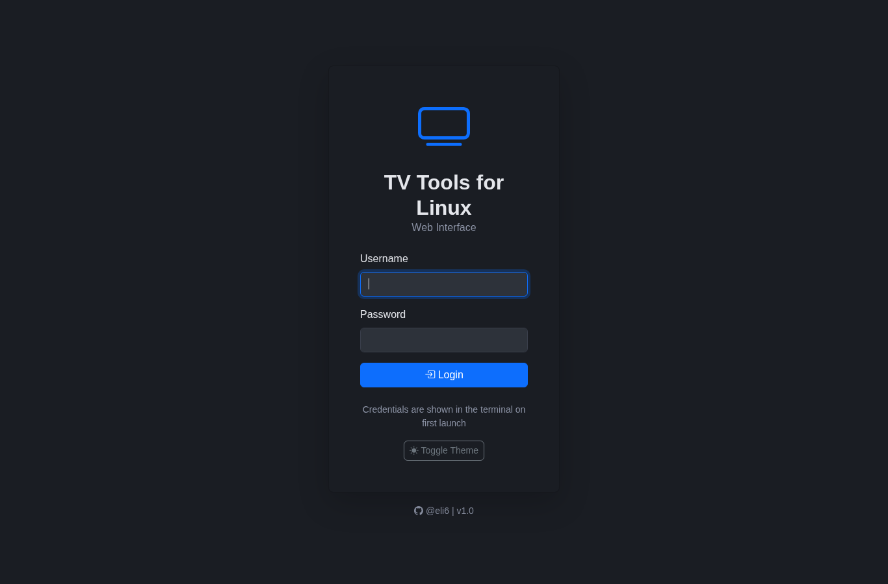

# TV Tools for Linux


**Control, manage, and de-bloat your Android TV from Linux** — over ADB, with no Windows or macOS required. TV Tools ships as both a **terminal CLI** and a **browser-based Web UI**, so you can drive your TV from a shell or from any device on your network.

> Built for Linux, by a Linux user. Auto-installs ADB and scrcpy across 40+ distributions.

**Author:** [@eli6](https://github.com/EliseyRotar) · **Repo:** [EliseyRotar/tv-tools-for-linux](https://github.com/EliseyRotar/tv-tools-for-linux)

---

## Screenshots

### Web UI

| Dashboard | Tools & Utilities |
| :---: | :---: |
|  |  |

| Device Settings | Advanced (Backup / Batch) |
| :---: | :---: |
|  |  |

| Multi-Device Management | Login |
| :---: | :---: |
|  |  |

### CLI

```text
╔══════════════════════════════════════════════════════════════════════════════╗
║                          🚀 TV Tools for Linux v1.0                            ║
║                Author: @eli6 | https://github.com/EliseyRotar                  ║
╠══════════════════════════════════════════════════════════════════════════════╣
║  📱 Connected: 192.168.1.11:5555 (Sony BRAVIA 4K)                              ║
╠══════════════════════════════════════════════════════════════════════════════╣

   Main Menu

   1.  📁 File Transfer            8.  ⚡ Optimizations
   2.  📦 App Management           9.  🎤 Voice Commands
   3.  💾 Backup & Restore        10.  🎮 Remote Control
   4.  ⚙️  Custom Settings        11.  🛡️  Ad Blocking
   5.  🖥️  Display Settings       12.  📊 Device Info
   6.  📸 Screenshot & Recording  13.  📈 System Monitor (btop)
   7.  ⬇️  Installation Helper    14.  🔌 Disconnect Device
                                   15.  🚪 Exit

   Enter your choice (1-15, 0 to exit):
```

---

## Features

### Device Management
- Connect over Wi-Fi (ADB IP) or USB
- Network scanner to auto-discover Android TV devices
- Wireless ADB setup, multi-device support
- Live connection status and reconnect to last device

### App Management
- Install / uninstall / enable / disable apps
- Batch operations across many packages at once
- Search and list packages with friendly names
- Bloatware removal with risk-tiered categories (safe → aggressive)

### One-Click App Installer
Auto-download and install popular TV apps:
- **SmartTube** (ad-free YouTube)
- **TiviMate**, **Kodi**, **TDTChannels** (IPTV)
- **Aurora Store**, **Aptoide TV** (app stores)
- **Projectivy**, **FLauncher**, **Google TV** (launchers)
- **Stremio**, **Shizuku**

### Backup & Restore
- Full APK backup with metadata tracking
- Batch backup/restore, archive management

### File Operations
- Push / pull files
- Built-in FTP server integration
- Clipboard text transfer to the device

### Screen Tools
- Screenshot capture with a gallery
- Screen recording
- **Live screen mirror via scrcpy**

### Settings Control
- Screen timeout, animation scale, display density, font size
- USB debugging, ADB-over-network, stay-awake, GPS, unknown sources
- Toggle automatic OTA updates

### Ad Blocking
- Private DNS (AdGuard, ControlD, Cloudflare)
- AdGuard app installation

### System Tools
- System monitor (CPU / memory / storage / battery / temps)
- Diagnostics: logcat, processes, storage management
- Permission manager, IME manager, accessibility helpers
- Icon generation for hidden apps, auto-update checker

### Web UI
A full-featured browser interface with feature parity to the CLI — manage your TV from your phone, laptop, or any device on your LAN.

---

## Quick Start

### 1. Clone

```bash
git clone https://github.com/EliseyRotar/tv-tools-for-linux.git
cd tv-tools-for-linux
```

### 2. Run

```bash
# Interactive CLI
python android-tv-tools.py

# Web UI (default: http://127.0.0.1:5000)
python android-tv-tools.py --web --port 8080
```

ADB is detected automatically and installed for you if missing. On first launch of the Web UI, a random admin password is generated and printed to your terminal.

### 3. (Optional) Install system-wide

```bash
chmod +x install.sh
./install.sh
android-tv-tools
```

---

## Connecting Your Device

1. **Enable ADB on your Android TV**
   - Settings → Device Preferences → About → click **Build** 7 times
   - Settings → Device Preferences → Developer Options → enable **Network debugging**
2. **Find your TV's IP**
   - Settings → Network & Internet → your network → Advanced → IP address
3. **Connect** — enter the IP in the CLI / Web UI, or type `FIND` in the CLI to scan your network.

---

## Web UI Security

The Web UI is built for safe LAN use:

- **No default password.** A random admin password is generated on first run and stored hashed at `~/.android-tv-tools/web_credentials.json`.
- **Override credentials** with environment variables for headless setups:
  ```bash
  TVTOOLS_WEB_USER=myuser TVTOOLS_WEB_PASSWORD=mypass python android-tv-tools.py --web
  ```
- Session secret is persisted (sessions survive restarts), cookies are `HttpOnly` + `SameSite=Lax`.
- Loopback (`127.0.0.1`) connections are trusted for local single-user convenience.

> The bundled server is Flask's development server. For exposure beyond your trusted LAN, place it behind a reverse proxy with TLS.

---

## Supported Linux Distributions

ADB and scrcpy are auto-installed. The tool detects your package manager from `/etc/os-release` (`ID` / `ID_LIKE`) or by scanning for known package-manager binaries — so even unlisted distros generally work.

| Family | Distros | Package Manager |
| --- | --- | --- |
| Arch | Arch, Manjaro, EndeavourOS, Garuda, CachyOS, Artix, Parabola | `pacman` |
| Debian/Ubuntu | Ubuntu, Debian, Mint, Pop!_OS, Kali, Parrot, Zorin, Raspberry Pi OS, Elementary, MX, Deepin, Devuan | `apt` |
| Fedora/RHEL | Fedora, RHEL, CentOS, AlmaLinux, Rocky, Oracle, Nobara, Ultramarine | `dnf` |
| openSUSE | Leap, Tumbleweed, SLES | `zypper` |
| Alpine | Alpine | `apk` |
| Void | Void | `xbps-install` |
| Gentoo | Gentoo, Funtoo, Calculate | `emerge` |
| NixOS | NixOS | `nix-env` |
| Solus | Solus | `eopkg` |
| Clear Linux | Clear Linux OS | `swupd` |
| Slackware | Slackware | `slackpkg` |
| Mageia | Mageia | `urpmi` |

---

## Requirements

- A Linux distribution (see table above)
- Python 3.8+
- ADB (auto-installed) — and scrcpy for live screen mirroring (auto-installed)
- For the Web UI: `flask`, `werkzeug`, `requests`, `colorama`
  ```bash
  pip install flask werkzeug requests colorama
  ```

---

## Configuration

Config lives at `~/.android-tv-tools/`:

| File | Purpose |
| --- | --- |
| `config.json` | App settings (timeout, scan range, directories) |
| `device_history.txt` | Connection history |
| `web_credentials.json` | Hashed Web UI credentials (mode `600`) |
| `flask_secret.key` | Persisted session secret (mode `600`) |
| `backups/` · `downloads/` | Backup archives and downloaded APKs |

---

## Troubleshooting

| Problem | Fix |
| --- | --- |
| **Cannot connect** | Verify the IP, enable Network debugging, ensure port `5555` is reachable, try `adb kill-server` |
| **Permission denied** | `sudo usermod -aG adbusers $USER`, then re-login |
| **APK install fails** | Enable "Unknown sources", check free space and APK architecture |
| **Web UI shows "Not Connected"** | Connect a device from the Dashboard before using device-specific pages |
| **Forgot Web UI password** | Delete `~/.android-tv-tools/web_credentials.json` — a new one is generated on next launch |

---

## Contributing

PRs welcome — clone, branch, and open a pull request. Issues and feature requests go in the [GitHub Issues](https://github.com/EliseyRotar/tv-tools-for-linux/issues) tab.

## License

MIT — see [LICENSE](LICENSE).

---

**Made for Linux by [@eli6](https://github.com/EliseyRotar)**
